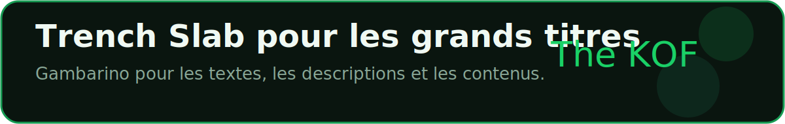

<a href="https://www.thekof.site">
  
</a>

<div align="center">

[](https://www.thekof.site)
[](https://www.linkedin.com/in/elton27/)
[](https://www.facebook.com/eltonhounnou/)
[](mailto:eltonhounnou27@gmail.com)
[](https://wa.me/2290140663349)

<br/>


</div>

---

## `$ whoami`

```typescript
const theKof: FrontendDeveloper = {
  nom: "Elton Ronald Bill HOUNNOU",
  alias: "The KOF",
  localisation: "Abomey-Calavi, Benin — GMT+1",
  tagline: "Des interfaces nettes pour des produits qui avancent.",
  focus: [
    "Frontend engineering — React, TypeScript, UI systems",
    "SaaS dashboards — Supabase, analytics, admin panels",
    "AI product interfaces — chatbots, assistants, automation",
    "Web performance — SEO technique, responsive design, DX",
  ],
  formation: "Systemes Informatiques et Logiciels — ESM-BENIN",
  stack: ["React", "TypeScript", "Supabase", "Tailwind CSS", "Vite", "Framer Motion"],
  valeurs: ["clarte", "performance", "rigueur", "experience utilisateur"],
  portfolio: "https://www.thekof.site",
  disponible: true,
};
```

---

## Identite Visuelle

<div align="center">



<br/><br/>

| Token | Usage | Couleur |
|:---:|:---|:---:|
| `#0A150F` | Fond sombre du portfolio |  |
| `#179B53` | Vert principal The KOF |  |
| `#1AD166` | Vert primaire dark mode |  |
| `#22AA7F` | Accent interface |  |
| `#0AFF8D` | Glow neon |  |

</div>

---

## Stack Technique

<div align="center">

**Frontend & Experience**


<br/><br/>


**Backend, Data & Cloud**


<br/><br/>


**Languages, Tools & Product**


<br/><br/>


</div>

---

## Projets En Production

<div align="center">

> Chaque carte embarque une image du projet, une description courte, le statut, la categorie, la stack et les liens utiles. Les visuels utilisent les polices du portfolio: Trench Slab pour les titres, Gambarino pour les textes.

</div>

<a href="https://my-africhat.vercel.app/">
  
</a>

<p align="center">
  <a href="https://my-africhat.vercel.app/"></a>
</p>

<a href="https://keep-baseai.vercel.app/">
  
</a>

<p align="center">
  <a href="https://keep-baseai.vercel.app/"></a>
</p>

<a href="https://vaultify-woad.vercel.app/">
  
</a>

<p align="center">
  <a href="https://vaultify-woad.vercel.app/"></a>
  <a href="https://github.com/REBCDR07/vaultify-woadai"></a>
</p>

<a href="https://sitesight-audit.vercel.app/">
  
</a>

<p align="center">
  <a href="https://sitesight-audit.vercel.app/"></a>
  <a href="https://github.com/REBCDR07/sitesight-audit"></a>
</p>

<a href="https://www.thekof.site">
  
</a>

<p align="center">
  <a href="https://www.thekof.site"></a>
  <a href="https://github.com/REBCDR07/elton_dev"></a>
</p>

<a href="https://esm-beninbj.vercel.app/">
  
</a>

<p align="center">
  <a href="https://esm-beninbj.vercel.app/"></a>
  <a href="https://github.com/REBCDR07/esmbenin"></a>
</p>

<a href="https://voyage-bj.vercel.app/">
  
</a>

<p align="center">
  <a href="https://voyage-bj.vercel.app/"></a>
  <a href="https://github.com/REBCDR07/VoyageBj"></a>
</p>

<a href="https://skillflash-tau.vercel.app/">
  
</a>

<p align="center">
  <a href="https://skillflash-tau.vercel.app/"></a>
</p>

<a href="https://pypi.org/project/fingerlock/">
  
</a>

<p align="center">
  <a href="https://pypi.org/project/fingerlock/"></a>
  <a href="https://github.com/REBCDR07/fingerlock"></a>
</p>

<a href="https://vald-s.vercel.app/">
  
</a>

<p align="center">
  <a href="https://vald-s.vercel.app/"></a>
  <a href="https://github.com/REBCDR07/TechChallenge14.0"></a>
</p>

<a href="https://github.com/REBCDR07/remind-me">
  
</a>

<p align="center">
  <a href="https://github.com/REBCDR07/remind-me"></a>
</p>

<a href="https://github.com/REBCDR07/easter-clicker">
  
</a>

<p align="center">
  <a href="https://github.com/REBCDR07/easter-clicker"></a>
</p>

---

## GitHub Stats

<div align="center">


</div>

<div align="center">


</div>

<div align="center">


</div>

---

## Parcours & Disponibilite

<div align="center">

| Localisation | Timezone | Formation | Disponibilite |
|:---:|:---:|:---:|:---:|
| Abomey-Calavi, Benin | GMT+1 | Systemes Informatiques — ESM-BENIN | Freelance · Collaboration · Remote |

</div>

---

## Derniers Axes De Travail

- Interfaces produit React/TypeScript avec une experience fluide sur mobile et desktop.
- Dashboards admin avec Supabase, authentification, analytics et edition Markdown.
- Assistants IA embarquables pour portfolios, SaaS, support client et produits web.
- Optimisation performance: images WebP, chargement progressif, SEO technique et accessibilite.
- Outils CLI pour automatiser les workflows frontend et la gestion d'assets.

---

## Contact

<div align="center">

<a href="https://www.thekof.site">
  
</a>
<a href="mailto:eltonhounnou27@gmail.com">
  
</a>
<a href="https://www.linkedin.com/in/elton27/">
  
</a>
<a href="https://www.facebook.com/eltonhounnou/">
  
</a>
<a href="https://wa.me/2290140663349">
  
</a>
<a href="https://devbenin.bj/profile/d981ca30-71aa-426d-a918-d7c0a10b4f68">
  
</a>
<a href="https://www.225os.com/profile/279001a9-25cf-414b-ab40-f6e3ba96779b">
  
</a>

</div>

<br/>

<a href="https://www.thekof.site">
  
</a>
