<a href="https://www.thekof.site">
  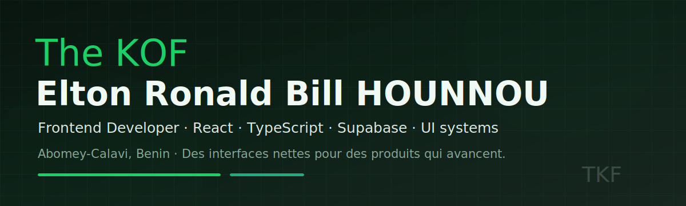
</a>

 

---

## `$ whoami`

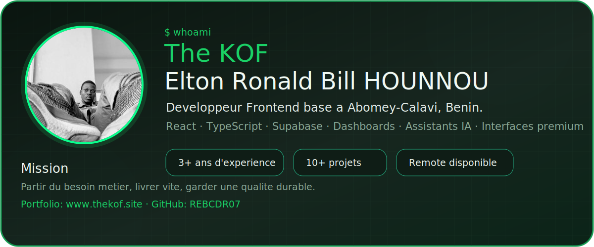

---

## Stack Technique


---

## Projets En Production

> Chaque carte embarque une image du projet, une description courte, le statut, la categorie, la stack et les liens utiles. Les visuels utilisent les polices du portfolio: Trench Slab pour les titres, Gambarino pour les textes.

<a href="https://www.npmjs.com/package/@eltkof7/webimg-cli">
  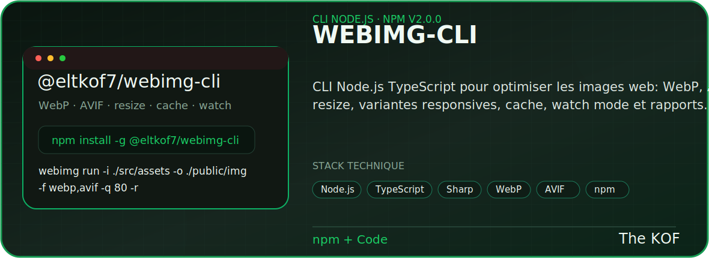
</a>

  
  

  <code>npm install -g @eltkof7/webimg-cli</code> 
  <code>webimg run -i ./src/assets -o ./public/img -f webp,avif -q 80 -r</code>

<a href="https://my-africhat.vercel.app/">
  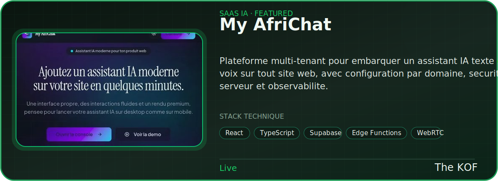
</a>

  

<a href="https://keep-baseai.vercel.app/">
  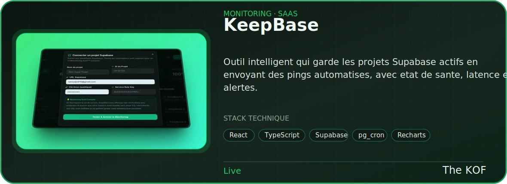
</a>

  

<a href="https://vaultify-woad.vercel.app/">
  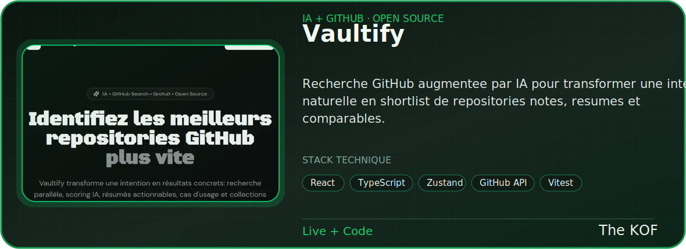
</a>

  
  

<a href="https://sitesight-audit.vercel.app/">
  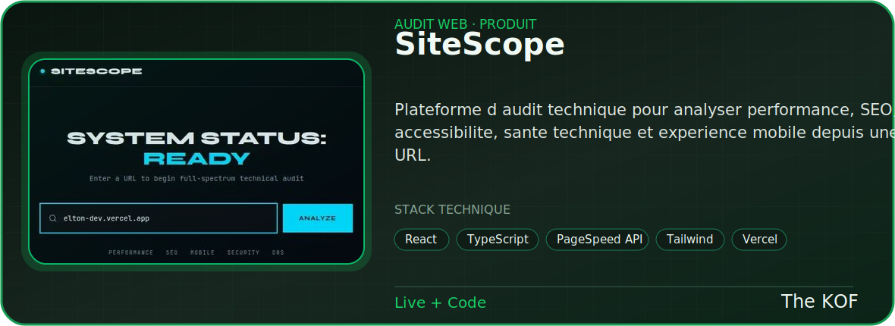
</a>

  
  

<a href="https://www.thekof.site">
  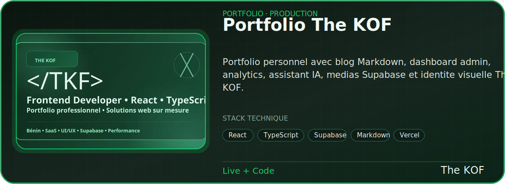
</a>

  
  

<a href="https://esm-beninbj.vercel.app/">
  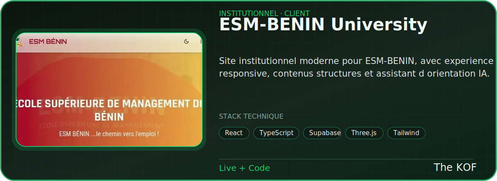
</a>

  
  

<a href="https://voyage-bj.vercel.app/">
  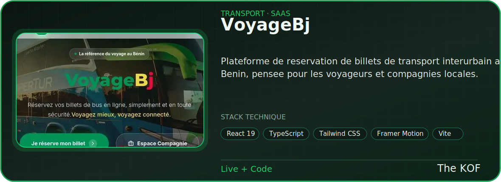
</a>

  
  

<a href="https://skillflash-tau.vercel.app/">
  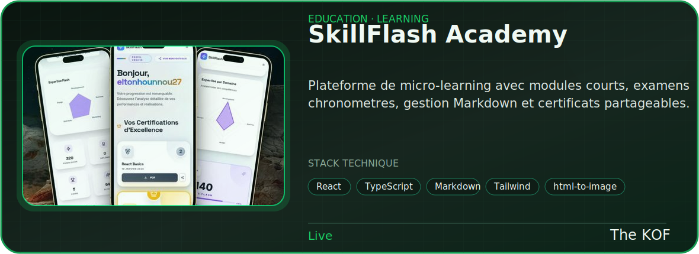
</a>

  

<a href="https://pypi.org/project/fingerlock/">
  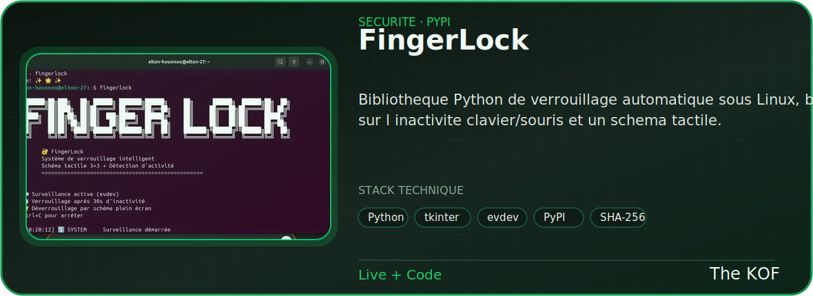
</a>

  
  

<a href="https://vald-s.vercel.app/">
  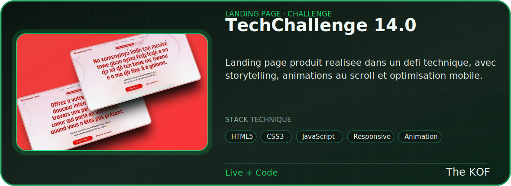
</a>

  
  

<a href="https://github.com/REBCDR07/remind-me">
  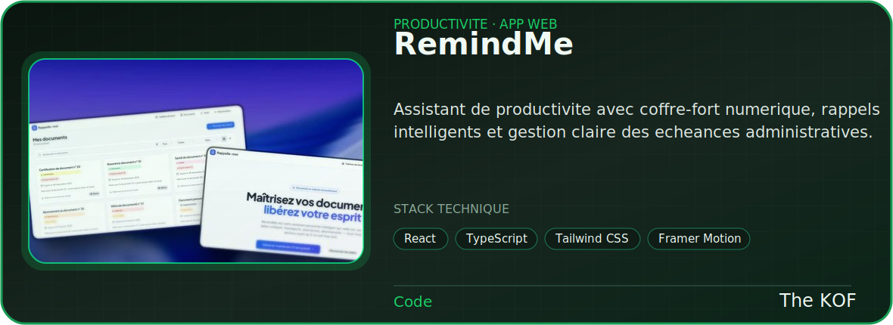
</a>

  

<a href="https://github.com/REBCDR07/easter-clicker">
  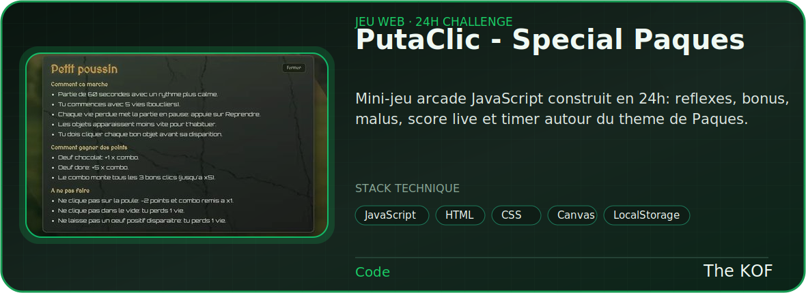
</a>

  

---

## GitHub Stats

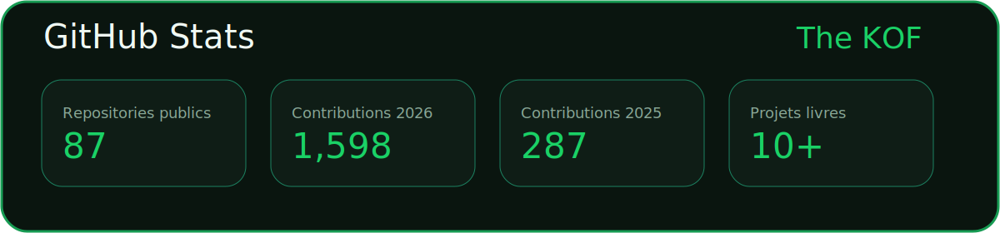
  
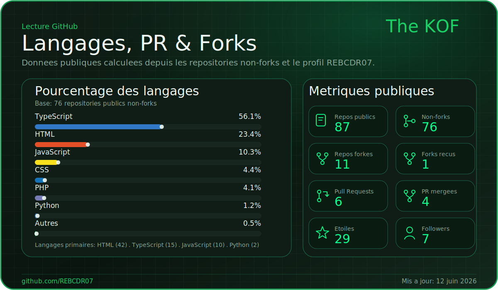
  
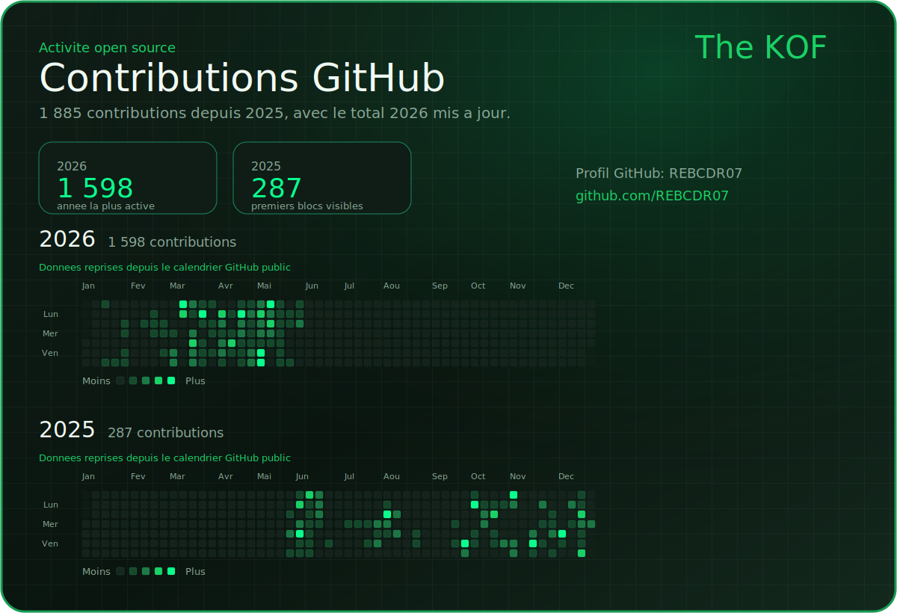

---

## Parcours & Disponibilite

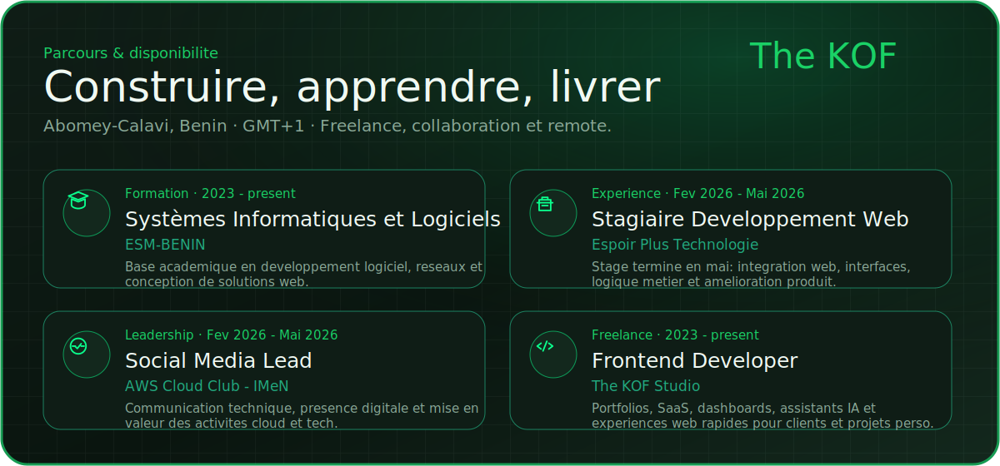

---

## Derniers Axes De Travail

- Interfaces produit React/TypeScript avec une experience fluide sur mobile et desktop.
- Dashboards admin avec Supabase, authentification, analytics et edition Markdown.
- Assistants IA embarquables pour portfolios, SaaS, support client et produits web.
- Optimisation performance: images WebP, chargement progressif, SEO technique et accessibilite.
- Outils CLI pour automatiser les workflows frontend et la gestion d'assets.

---

## Contact

 

<a href="https://www.thekof.site">
  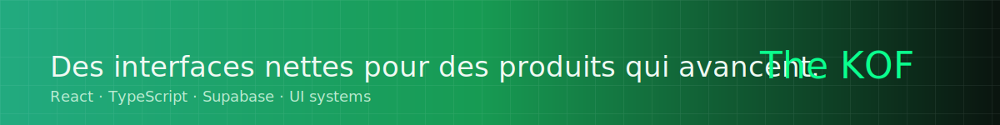
</a>
